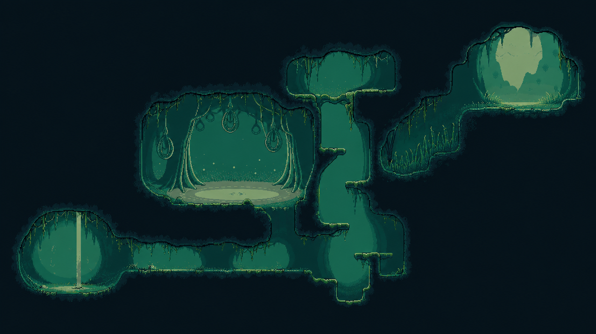

# Art Style Guide — Pixel Art

> Codex가 프롬프트를 생성할 때 반드시 이 문서를 참조합니다.
> 스타일 결정이 변경될 경우 이 파일을 먼저 수정하고, ART_LOG.md에 기록합니다.

---

## 기본 사양

| 항목 | 값 |
|------|----|
| 스타일 | 픽셀 아트 (Pixel Art) |
| 기본 스프라이트 크기 | 32x32 px (플레이어/주요 NPC/일반 적), 16x16 px (타일/소형 소품) |
| 보스 스프라이트 크기 | 64x64 ~ 96x96 px |
| 픽셀 밀도 | AK-xolotl: Together 수준의 높은 인디 픽셀 밀도. 단, 레퍼런스는 밀도만 참고하고 톤/구도/IP는 복제하지 않는다 |
| 스케일/PPU | PPU 32 기준. 32px 캐릭터 = 1유닛, 16px 타일 = 0.5유닛. **예외: 플레이 레이어 주역(B 무리비 / A 플레이어)은 64px 원화를 PPU 64로 임포트한다 = 역시 1유닛** (B 2026-08-21, A 2026-08-22). 타일·일반 적·기타 NPC는 32/16px 유지 |
| 팔레트 | 미정 (첫 구역 확정 시 설정 예정) |
| 아웃라인 | 1px 다크 아웃라인 |
| 디더링 | 제한적 사용 (그라디언트 표현 시만) |

---

## 픽셀 밀도 기준 (2026-08-20 확정)

기존 16x16 캐릭터 기준은 A/B의 필수 정보량(스위치, 단안 렌즈, 롤러, 잎귀, 랩, 눈)이 뭉개져 폐기한다. 이후 플레이 레이어 캐릭터는 32x32를 기본 셀로 삼는다.

- **캐릭터**: 32x32 안에 주 실루엣 1개 + 정체성 디테일 2~3개만 남긴다. 작은 반복 장식은 금지.
- **타일**: 16x16 모듈을 유지하되, 화면 밀도는 상단 캡, 크랙, 이끼, 소품, 파편, 배경 장식 레이어로 올린다.
- **배경/구역 컨셉**: 큰 덩어리 구조를 먼저 잡고, 빈 공간에는 작고 읽히는 생활 흔적을 배치한다. 노이즈로 채우지 않는다.
- **팔레트**: 기존 A/B 후처리처럼 저채도 램프를 사용한다. 색 수를 늘려 밀도를 올리지 말고, 명암 단과 엣지 릴라이트로 올린다.

### ⚠️ B(무리비)는 예외다 — 64px 원화 + PPU 64 (2026-08-21 확정)

B의 컨셉 15종은 전부 64x64로 그려졌고, **32x32로 내리면 눈 규격(검은 구체+크림 하이라이트+갈색 크레센트)과 잎귀가 뭉개진다.** 인게임 실측으로 확인하고 사용자가 원화 유지를 택했다.

- **PPU 64로 임포트하면 64px = 1유닛** 이라 A와 키가 같다. 크기 문제는 없다.
- 대가는 **B의 픽셀이 A·타일의 절반 크기**라는 것. 확대하면 B의 아웃라인이 A보다 가늘게 보인다. 이건 알고 받아들인 값이다.
- **다운스케일로 32px를 만들지 말 것.** 시도해서 폐기했다(`tools/pose-to-sprite32.py` 에 방법과 한계가 남아 있다). 밀도를 되찾으려면 **32px 네이티브 재생성**이어야 한다 — A가 그렇게 만들어졌다.
- **A(플레이어)도 64px로 전환한다 (2026-08-22, idle부터).** B가 64px인데 A만 32px이면 두 주역의 픽셀 밀도가 어긋난다. A는 32px 네이티브라 밀도 자체는 좋지만, 64px B와 나란히 서면 셀 크기가 절반이라 서로 다른 해상도로 읽힌다. → **A도 64px/PPU 64로 통일.** ⚠️ **현재는 idle 4프레임만 64px 전환됨. run/jump/fall/turn(14장)은 아직 32px** — 셋 다 PPU 상 1유닛이라 크기는 같지만 idle↔이동 전환 시 밀도가 튄다. 나머지도 64px 재생성이 남은 부채다.
- 이 예외(64px)는 **플레이 레이어 주역(A·B)에만** 적용한다. 다른 캐릭터·적·NPC는 32x32 / PPU 32를 유지한다.
- **금지**: 안티앨리어싱, 소프트 글로우, 과채도 만화색, 총기/고어/탑다운 슈터 문법, AK-xolotl 캐릭터나 UI의 직접 복제.

목표는 "귀엽고 조밀한 인디 픽셀 화면"의 해상감이지, AK-xolotl의 밝고 폭력적인 탑다운 톤이 아니다. Miji의 기준은 여전히 쓸쓸함, 적막, lived-in, 소박한 민속 기계다.

---

## 팔레트 (미정 — 구역별로 확장 예정)

> 첫 구역이 확정되면 이 섹션에 HEX 코드를 추가합니다.

```
[BASE PALETTE — TBD]
배경:    #??????
플랫폼:  #??????
적:      #??????
플레이어: #??????
UI:      #??????
```

---

## 캐릭터 스프라이트 애니메이션 프레임 기준

| 애니메이션 | 최소 프레임 | 권장 프레임 |
|-----------|------------|------------|
| Idle      | 2          | 4          |
| Walk/Run  | 4          | 6          |
| Jump      | 2          | 3          |
| Fall      | 1          | 2          |
| Attack    | 3          | 5          |
| Hurt      | 2          | 3          |
| Death     | 4          | 6          |
| Special   | 4          | 8          |

---

## Codex 요청 프롬프트 템플릿

```
Pixel art sprite sheet, [WIDTH]x[HEIGHT] pixels per frame, [N] frames.
Subject: [캐릭터/오브젝트 설명]
Animation: [애니메이션 유형]
Style: dense indie pixel art, 1px dark outline, limited palette
Pixel density: comparable detail density to AK-xolotl: Together screenshots, used only as a density reference; do not copy its characters, UI, weapons, gore, top-down composition, or bright comedic tone
Palette: [팔레트 제약 — 색상 수, 주요 색상]
Mood/Theme: [분위기 — 예: dark gothic dungeon, melancholic]
No anti-aliasing, no gradients (except limited dithering).
Transparent background (PNG).
```

---

## 생성 프롬프트 금지 사항 (2026-08-21 확정)

생성 모델(higgsfield·PixelLab 등)로 캐릭터를 뽑을 때 매번 되풀이된 실패를 규칙으로 굳힌 것이다.

- **평면적으로 보이는 각도를 요청하지 않는다.** 정측면·납작한 옆모습은 이 화풍에서 입체감이 죽는다.
  **3/4 앵글을 기본**으로 요청한다. (2026-08-21 사용자 지시 — B 포즈 04·09가 이 이유로 폐기됨)
- **눈은 검은 구체 + 작은 하이라이트다.** 흰자위·동공 분리를 금지한다고 프롬프트에 써도 모델은
  「놀람·크게 뜬 눈」 지시를 받으면 흰자위로 그린다. **표정 극단값은 생성이 아니라 수작업 픽셀 수정으로 만든다.**
- **소품을 금지해도 모델은 받침대·선반을 발명한다.** 「들여다보기」류 포즈는 특히 그렇다. 생성 후 검수 항목에 넣는다.
- ★ **깜빡임은 「넣지 마라」가 아니라 「지속 시간을 생성에 맡기지 마라」다** (2026-08-21 B idle 1차).
  4프레임/6fps 루프에 깜빡임을 프레임 하나로 넣으면 **0.167초를 0.67초마다** = 전체의 25%를 감고 있게 되어
  깜빡임이 아니라 **목인사로 읽힌다**. 실제 깜빡임은 **0.1초를 2~5초에 한 번**이다.
  → **프레임이 몇 초 떠 있을지는 `.anim` 클립이 정한다.** 생성에는 「깨끗한 감은 눈 프레임 1장」만 요구하고
  타이밍은 Unity에서 잡는다(랜덤 간격은 클립에 굽지 말고 `TurnView` 식 LateUpdate 덮어쓰기로).
- ★ **미세 모션(숨쉬기·아이들)을 요청하면 모델은 남는 표현 여지를 눈으로 채운다.**
  숨쉬기는 **몸통·귀·꼬리**에만 주고 **머리는 움직이는 주체에서 뺀다** — 1px이라도 위아래로 가면 인사가 된다.
  눈을 고정하려면 **「전 프레임 레퍼런스에서 픽셀 단위로 복사」**를 명시하고, **프레임마다 할 일을 따로 지정**할 것.
- ★ **「감은 눈」만 쓰면 모델은 웃는 눈(위로 휜 ^ 아치)을 가져온다** — `B06_laugh` 가 그 형태다.
  중립 깜빡임은 **평평하거나 살짝 아래로 휜 직선**임을 명시해야 깜빡일 때마다 웃지 않는다.
- **칸 경계 여백 지시는 지켜지지 않는다.** 시트로 여러 포즈를 한 번에 뽑으면 캐릭터가 잘린다.
  예산이 허락하면 포즈당 낱장으로 생성한다.

---

## 스타일 일관성 체크리스트

Codex로부터 받은 스프라이트를 검토할 때 확인합니다:

- [ ] 아웃라인이 1px dark인가?
- [ ] 팔레트 범위를 벗어난 색이 없는가?
- [ ] 안티앨리어싱이 없는가?
- [ ] 스프라이트 크기가 사양과 일치하는가?
- [ ] 32x32 캐릭터에서 정체성 디테일 2~3개가 살아 있고, 작은 반복 장식으로 뭉개지지 않는가?
- [ ] 게임의 분위기(Mood)와 시각적으로 맞는가?
- [ ] 애니메이션 프레임 수가 최소 기준 이상인가?

---

## 세계 아트 디렉션 (2026-08-07 확정)

`docs/DECISIONS.md` 2026-08-07 행에서 확정. 상세·프롬프트는 `docs/art/WORLD_TECH_LEVEL_COMPARISON.md`.

- **기술 수준 ㉮** — 소박한 기계가 일상, 느린 도보 여행 문화와 공존. 몰락 문명 유물·첨단 SF **배제**
- **비인간·유기적 건축** — 인간 건축(목조 집·사각 문/창·인간 비율) **금지.** B의 종은 비인간 생명체다
- **기계는 소박한 민속 기술** — 손때 묻은 낡은 도구. 매끈한 SF **금지**
- **A(플레이어)** — 이 세계에 어울리는 시시한 생활용 기계. 신비한 유물로 보이면 실패(「무의미 반전 금지」)
- **질감 기준** — Codex 픽셀 렌더링 톤을 파이프라인 기준선으로 확정
- **톤** — 쓸쓸함·적막·lived-in. 정신경제/붕괴에서 오는 애수 (기계 유무가 아니라)
- **자연 공동은 상징화하지 않는다** — 나무 구멍·뿌리 아치·암벽 공동을 하트·얼굴·문장처럼 정면 대칭 아이콘으로 만들지 않는다. 비대칭 침식과 성장 흔적으로 읽혀야 한다

---

## 구역별 아트 디렉션 — 비인간 건축 서명 3종

> `깃든 사물 = 구역`이므로 구역마다 다른 비인간 종의 건축을 입힌다. 구역-서명 배정은 지리 설계(핸드오프 1번) 때 확정. 팔레트 HEX는 채택 컨셉 이미지에서 샘플링 예정.

| 서명 | 건축 | 분위기 키워드 | 팔레트 |
|------|------|-------------|--------|
| **껍질·굴** | 거대 나선 껍질·키틴판을 파내고 흙 둔덕에 굴. 문 대신 둥근 구멍 | 단단·쓸쓸, 할로우나이트식 낯섦 최강 | TBD (샘플링) |
| **균사·버섯** | 거대 균류에서 자라난 버섯 갓 지붕·포자 등불. 지은 게 아니라 자란 마을 | 습하고 몽환 | TBD (샘플링) |
| **엮은 둥지** | 뿌리·갈대·실로 엮어 매단 둥지 포드·매듭 아치 | 연약·따뜻, 수공예 유기 | TBD (샘플링) |

---

## 타일 설계 원칙 — "자연스러운 타일" 재현 (2026-08-28 확정)

할로우나이트(※ 벡터·비픽셀)의 자연스러운 타일 감을 **픽셀에서** 재현하기 위한 규칙. 타일을 실제로 만들 때 이 섹션을 척도로 삼는다.

**핵심 3원리 (분석 결과):**
1. **어포던스 가독성 = 대비.** 상호작용면(걷는 바닥·벽점프 벽)은 실루엣을 **정돈**하고, 비상호작용 지형은 **유기적·노이즈**로 만들어 뒤로 민다. 자연스러움이 아니라 둘의 대비가 정체다.
2. **콜라이더 ≠ 타일 아트.** 충돌 폴리곤은 아트보다 **더 단순한 깨끗한 선**으로 별도 배치(EdgeCollider). 아트(풀·이끼·턱)는 콜라이더 위로 살짝 삐져나오게 → **발판은 정확한데 가장자리는 유기적.**
3. **평면 분리는 라이팅·채도로.** 플레이 평면은 채도↑·림라이트, 배경은 채도↓·명도↓·푸른 공기감. → 기존 패럴랙스 depth tint(0.50~0.85 + 살짝 푸르게)가 이 원리.

### 승인 레퍼런스 — 타일 그리드 은폐 (2026-09-04)



사용자가 위 이미지를 맵·타일 아트 레퍼런스로 승인했다. **승인 범위는 정확한 룸 배치나 토폴로지가 아니라 지형 표현 방식**이다.

- **플레이 가능 면:** 걷기·착지 가능한 **상단은 수평 직선**, 벽타기 가능한 **측면은 수직 직선**으로 유지한다. 둘 다 16x16 충돌 모듈에 정렬하고 세이지 림라이트로 즉시 읽히게 한다. 경사 이동 메카닉을 별도로 확정하기 전에는 발판 상단에 경사·아치·물결·뿌리 곡선을 쓰지 않는다.
- **플레이 불가 덩어리:** 큰 곡선과 비선형 실루엣은 **천장, 벽타기가 불가능한 오버행·오목 벽, 발판 아랫부분, 전·후경 덩어리**에만 사용한다. 발판은 상단 충돌선은 직선으로 두고 아랫부분만 처지거나 갈라지는 뿌리 형태로 타일 그리드를 숨긴다.
- **재질 연속성:** 충돌선이 직선이어도 상단에 같은 사각 캡을 반복하거나 회색 석재 블록을 길게 나열하지 않는다. 나무결·뿌리 섬유·이끼·크랙이 가상의 타일 경계를 가로질러 주변 거목과 이어져야 하며, 플레이면은 얇은 세이지 림만 직선으로 읽힌다.
- **벽의 시각적 고정:** 수직 벽타기 면은 공중에서 갑자기 시작하는 얇은 벽 타일이나 ㄴ자 기둥으로 만들지 않는다. 반드시 천장·바닥·거목 몸통 중 하나에서 자라난 넓은 뿌리 절벽의 안쪽 면으로 보이게 하고, 연결부에는 뿌리 벌어짐과 연속된 나무결을 둔다.
- **경계 처리:** 이끼·잔풀·뿌리·크랙 데코가 타일 이음새를 가로질러야 한다. 동일 코너·캡의 규칙적 반복이 화면에서 보여서는 안 된다.
- **콜라이더:** 시각 실루엣을 그대로 추적하지 않는다. 플레이 판정은 단순하고 안정적인 별도 콜라이더로 유지한다.

이 이미지는 **스타일·표면 처리 정본 레퍼런스**이며, 정본 타일 에셋이나 데모의 확정 맵 구조는 아니다. 팔레트 정식 등록도 별도 승인으로 남긴다.

**그리드를 깨는 픽셀 기법:**
- 엣지 전이 타일을 코너/변 8~16종 손작업 (Rule Tile)
- 데코 패스 — 타일 위에 풀·돌·이끼 스프라이트를 **이음새를 가로질러** 흩뿌림
- 비반복 변형 — 같은 타일 3연속 금지, 변형 인덱스 랜덤

**타일 레퍼런스 (이 3개만):**
| 게임 | 볼 것 |
|------|------|
| **Blasphemous 1·2** | 픽셀 MV 정답지. 고해상 픽셀인데 타일 이음새가 안 보임 — 엣지/데코 오버레이가 경계를 가로지름. 림라이트 발판 |
| **Ori** (벡터) | 픽셀 아님. **레이어링·전경 안개·평면 분리**의 참고 |
| **Nine Sols** (핸드페인트) | 픽셀 아님. 동양 톤 + 상호작용/장식 가독성·전경 처리 참고 |

---

## 레이어 스택 (2026-08-28 확정)

렌더 순서 앞(위)→뒤(아래). 우측은 기존 sorting order 체계에 매핑. 상세 근거는 대화 로그(HK 레이어 재검증) 참조.

| 층 | 내용 | order |
|----|------|-------|
| **UI** | HUD (별도 Canvas, Screen Space) | — |
| **전경/분위기** | 앞 안개·먼지·전경 넝쿨·비네트 | **+20 이상 (신설 필요)** |
| **플레이 평면** | 플레이어·적·NPC·위험·**부숴지는 오브젝트**·상호작용 | 0 ~ +10 |
| **지형 타일맵** | 충돌 지형 | -10 ~ -9 |
| **근경 데코** | 비충돌 중경 구조물 | -5 |
| **디테일 배경** | 패럴랙스 근 | -45 ~ -15 |
| **흐려진 배경** | 큰 실루엣, 탈채도 | -90 ~ -62 |
| **하늘 그라디언트** | 최후경 | -95 |

- **부숴지는 오브젝트는 배경이 아니라 플레이 평면 소속** (상호작용 가능하므로).
- **전경 밴드(+11 이상)는 아직 없음** — HK식 자연스러움의 빈 곳. 신설 시 기존 `ParallaxLayer` 재사용, followFactor를 1보다 크게(1.05~1.2) 주면 전경이 카메라보다 빨리 흘러 앞에 있는 느낌.
- 현 프로젝트 매핑: 배경 밴드(-90~-15) ✅ / 플레이 밴드(-10~10) ✅ / 전경 밴드 ❌ / UI Canvas 별도.
