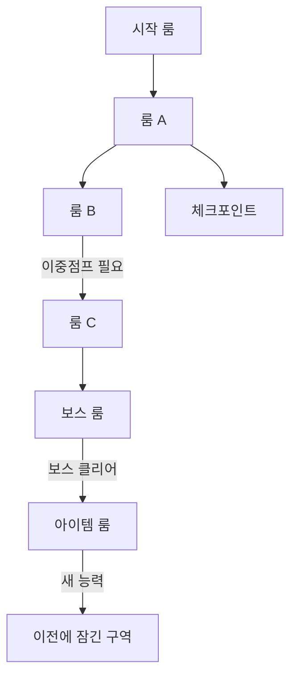

# Map Format Guide — Metroidvania

이 파일은 모든 맵 문서의 작성 기준입니다.
실제 맵 파일은 `MAP_[area-name].md` 형식으로 같은 폴더에 작성합니다.

---

## 1. ASCII Room Grid (공간 레이아웃)

룸의 물리적 위치와 인접 관계를 나타냅니다.
각 셀은 하나의 룸이며, 연결 방향은 `─`, `│`, `┼` 등으로 표시합니다.

```
기호 설명:
[ ]  일반 룸
[S]  시작 룸 (Start)
[B]  보스 룸 (Boss)
[C]  체크포인트 (Checkpoint / 세이브)
[I]  아이템 룸
[T]  전환 룸 (다른 구역으로 연결)
─    좌우 이동 연결
│    상하 이동 연결
╗╝╚╔ 코너 연결
×    잠긴 연결 (게이트 — 능력/아이템 필요)
```

### 예시
```
[S]─[  ]─[C ]
          │
[I ]×[  ]─[  ]
│
[B ]
```

---

## 2. Mermaid Connectivity Graph (진행 흐름)

룸 간 이동 가능 여부와 잠금/해제 조건을 나타냅니다.
공간 위치보다 **플레이어 진행 순서**에 초점을 맞춥니다.



**엣지 레이블 규칙:**
- 레이블 없음 → 무조건 통과 가능
- `|능력명 필요|` → 해당 능력 획득 후 통과
- `|아이템명|` → 특정 아이템 소지 필요
- `|보스 클리어|` → 특정 보스 격파 후 통과

---

## 3. Room Table (룸 메타데이터)

각 룸의 세부 정보를 정리합니다.

| 룸 ID | 룸 이름 | 구역 | 적 | 아이템 | 게이트 조건 | 비고 |
|-------|---------|------|---|--------|------------|------|
| R001 | 입구 홀 | 폐허 구역 | 없음 | 없음 | 없음 | 튜토리얼 |
| R002 | 어두운 복도 | 폐허 구역 | 슬라임 x2 | 없음 | 없음 | |
| R003 | 잠긴 방 | 폐허 구역 | 해골 x1 | 이중점프 | 이중점프 | |
| CP01 | 체크포인트 | 폐허 구역 | 없음 | 없음 | 없음 | 세이브 포인트 |
| B001 | 보스: 석상 | 폐허 구역 | 석상 골렘 | 대쉬 능력 | 없음 | 1번째 보스 |

---

## 4. 동선 설계 원칙 (Metroidvania)

**핵심 루프:**
```
탐색 → 능력 획득 → 역추적(Backtrack) → 새 구역 개방
```

**동선 체크리스트:**
- [ ] 시작 지점에서 첫 체크포인트까지 능력 없이 도달 가능한가?
- [ ] 각 잠긴 구역은 해당 키(능력/아이템)를 획득할 수 있는 경로가 존재하는가?
- [ ] 보스까지의 경로에 체크포인트가 합리적 거리 내에 있는가?
- [ ] 역추적 시 지름길(shortcut)이 제공되는가?
- [ ] 숨겨진 룸은 시각적 힌트를 주는가?

**구역(Area) 연결 규칙:**
- 구역 간 전환 룸[T]은 양방향으로 설계
- 구역 전환 전 반드시 체크포인트[C] 배치
- 첫 방문 시 막히는 구역은 맵에 `×`로 명시

---

## 5. 맵 파일 템플릿

새 구역 맵을 만들 때 아래 템플릿을 복사하여 `MAP_[area-name].md`로 저장합니다.

```markdown
# 맵: [구역 이름]

**구역 ID:** AREA_XXX  
**분위기:** [예: 어둡고 습한 폐허]  
**BGM 방향:** [예: 느리고 불안한 분위기]  
**연결 구역:** [예: 시작 구역, 동굴 구역]

---

## ASCII 레이아웃
(여기에 ASCII Room Grid 작성)

---

## 연결 그래프
(여기에 Mermaid graph 작성)

---

## 룸 목록
(여기에 Room Table 작성)

---

## 동선 메모
(설계 의도, 특이사항, 역추적 포인트 등 자유 서술)
```
